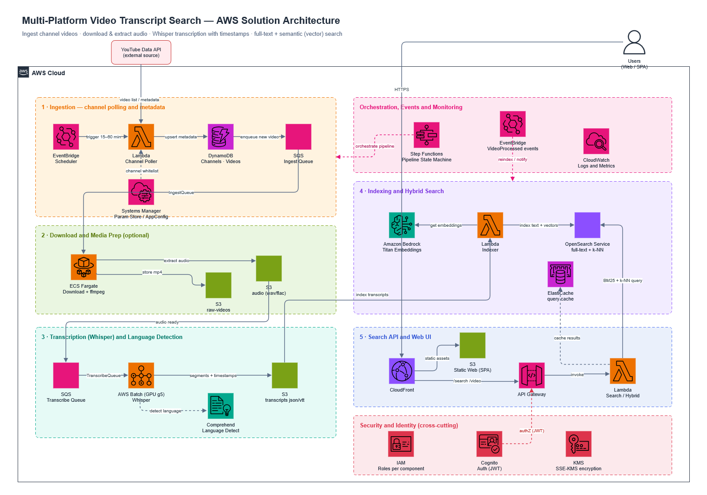

# Video Transcript Search Platform — AWS Architecture

A proposed **AWS architecture** (MVP → production) for ingesting videos from selected channels, transcribing them with timestamps, and exposing full-text + semantic search over what was said.

---

## 1) Key assumptions (technical requirements)

1. **Source**: YouTube (to start) + other platforms later.
2. **Scope**: only whitelisted channels from configuration.
3. **Result**: text search + “similar statements” (semantic).
4. **Time precision**: at least segments with `[start_sec, end_sec]` + text.
5. **Scaling**: queue + workers (CPU/GPU).
6. **Cost**: transcription is the most expensive part → make it as asynchronous and batched as possible.

---

## 2) High-level components (AWS)

### “Ingestion” layer (fetching the video list and metadata)

* **EventBridge Scheduler** (e.g., every 15–60 min) triggers a “channel poller”.
* **Lambda / ECS Fargate (poller)**:

  * reads the channel list from **AWS AppConfig / SSM Parameter Store**,
  * fetches new videos via the **YouTube Data API**,
  * writes metadata + deduplication.

**State / deduplication:**

* **DynamoDB** as a “registry”:

  * `Channels` (configuration, lastCheckedAt, etc.)
  * `Videos` (videoId, channelId, publishedAt, pipeline status, checksum/etag, etc.)

**Work queueing:**

* **SQS (IngestQueue)** – “new video to process” messages.

---

### “Download & Media Prep” layer (optional video download)

* **ECS Fargate / ECS EC2** (download worker) downloads the video (if needed) and stores it to:

  * **S3/raw-videos/{platform}/{channelId}/{videoId}.mp4**
* Generates audio (e.g., wav/flac) and stores it to:

  * **S3/audio/{...}/{videoId}.wav**

**Why ECS instead of Lambda?**

* downloading + ffmpeg can be heavy and long-running (Lambda limits on time, storage, duration).

---

### “Transcription” layer (Whisper)

Execution options:

* **AWS Batch** (most convenient for queues + GPU) on GPU instances (e.g., g5),
* or **ECS on EC2 with GPU** (a persistent cluster),
* or **EKS** (if you want Kubernetes and HPA autoscaling).

Pipeline:

1. A worker takes a job from **SQS (TranscribeQueue)**.
2. It downloads the audio from S3.
3. It runs Whisper:

   * returns segments with timestamps (e.g., every 1–10 s),
   * detects the language in parallel (Whisper can), or you support it with:

     * **Amazon Comprehend** (language detection), or
     * a simple model/heuristic (if cost matters).
4. Writes the results to S3 + indexing.

**Result artifacts in S3:**

* `S3/transcripts/{...}/{videoId}.json` (full transcript + segments)
* `S3/transcripts/{...}/{videoId}.vtt` (optional subtitles)

---

### “Indexing & Search” layer (full-text + semantic)

For this use case, **two indexes** are best:

#### A) Full-text (keywords, phrases, fuzzy)

* **Amazon OpenSearch Service** (classic inverted index)
* An index of segment documents:

  * one document = one spoken segment with a timestamp.

Example fields in the index:

* `videoId`, `channelId`, `platform`, `publishedAt`
* `startSec`, `endSec`
* `text` (the original segment text)
* `language`
* `speaker` (optional, later, via diarization)
* `confidence` / quality score

#### B) Semantic (similar statements)

* The same OpenSearch, but with **vectors (k-NN)**, or a separate vector index.
* Embedding generator:

  * **Bedrock** (e.g., Titan Embeddings) or your own embedding model in ECS/Batch,
  * embed segments (or larger “chunks” of ~30–60 s).

A user query then:

1. runs classic full-text (BM25)
2. plus vector similarity (kNN)
3. and combines the results (reranking / hybrid search).

---

## 3) User-facing API (search and results)

* **API Gateway** + **Lambda** (or a small service on ECS)
* Endpoints:

  * `GET /search?q=...&mode=hybrid|text|semantic&lang=...`
  * `GET /video/{videoId}` (metadata + transcript)
* UI:

  * a simple app (e.g., S3 + CloudFront) or an SPA on Amplify.

**The /search response** returns:

* a list of videos,
* for each one: title, channel, link to YouTube,
* and a list of “hits” with `startSec` (and a link like `...&t=123s`) + a text fragment.

---

## 4) Pipeline orchestration

Cleanest approach:

* **AWS Step Functions** as a “state machine” at the level of a single video:

  1. Validate + deduplicate
  2. Fetch metadata
  3. Download (optional)
  4. Extract audio
  5. Transcribe
  6. Index text
  7. Generate embeddings
  8. Index vectors
  9. Mark success/failure

Event-driven communication:

* SQS for “worker” tasks
* EventBridge for triggers and “VideoProcessed” events

---

## 5) Data model (the minimum that guarantees “time in the video”)

**DynamoDB (state/pipeline):**

* `Videos`: `PK=videoId`, fields: status, s3Paths, language, duration, timestamps, errorReason…

**OpenSearch (search):**

* a `segments` index:

  * one document per segment: `{videoId, startSec, endSec, text, language, embedding[] }`
* (optional) a `videos` index with metadata for faceting.

This gives a simple and fast answer: “where in the video a sentence was said”.

---

## 6) Language handling

* Whisper → detects the language and usually reports `language` + a confidence value.
* In the index, keep:

  * `language_detected`
  * `language_confidence`
* At search time:

  * an optional language filter,
  * embeddings are best generated with a multilingual model (so a “Polish query” finds English paraphrases and vice versa — if that’s what you want).

---

## 7) Security and cost

**Security**

* S3: block public access, SSE-KMS.
* IAM: a role per component (poller / downloader / transcriber / indexer).
* API: Cognito / IAM auth / your own JWT.

**Cost (the most important levers)**

* GPU/Batch: you pay for transcription compute → run it in batches + autoscaling + a queue.
* OpenSearch: cost depends on index size; finer segmentation (e.g., 5–10 s) increases the document count.
* Storage:

  * raw video can be kept only briefly (S3 lifecycle → Glacier / delete after X days), since audio + transcript usually suffice.

---

## 8) MVP vs “target”

### MVP (fastest to stand up)

* EventBridge Scheduler + Lambda poller (YouTube API)
* DynamoDB registry
* ECS (download + ffmpeg) → S3
* AWS Batch/ECS GPU (Whisper) → S3
* OpenSearch (full-text only) + segments with timestamps
* API Gateway + Lambda search

### Target (better search UX)

* Hybrid search (BM25 + vectors) + reranking
* Query result cache (ElastiCache)
* Diarization (who is speaking) + named-entity / topic recognition (NLP)

---

## 9) Possible next refinements (optional)

* A concrete **OpenSearch index configuration** (mapping/analyzers for PL/EN, fuzzy and phrase queries).
* A **segment chunking strategy** (e.g., 7–12 s vs 30–60 s) tuned for search quality versus cost.
